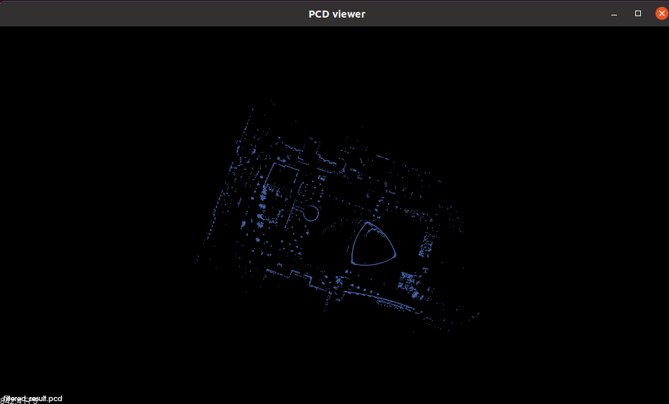

# nav2_3d_static_layer

`nav2_3d_static_layer` is a costmap_2d plugin, which is designed for add the information of pointcloud2 messages to costmap. 

The plugin will receive pointcloud2 messages from map server, and convert it into 2D costmap, the convertion process is realized in octmap, and the pc2 information is filtered through voxelgrid in PCL.

### OnInitialize Part

In this stage, the 3D map server is developing in process, so the observation part is replaced through reading PCD file information. Reading file part would be deleted after observation part tested well.

### PC2 Information Handling

The PC2 message will be filtered through voxelgrid in PCL, the result is:

And then use octotree convert it into 2D costmap, 

### Bringup Result

Run `ros2 launch nav2_bringup tb3_simulation_launch.py `

For better effect, the basic map is changed into a picture with the pointcloud message information. This plugin is added in global map, with inflation layer. The result in rviz is :

